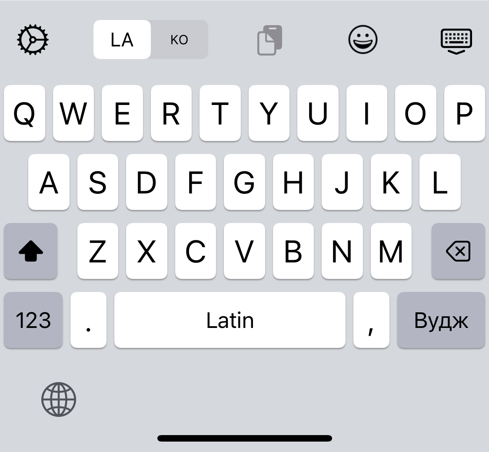
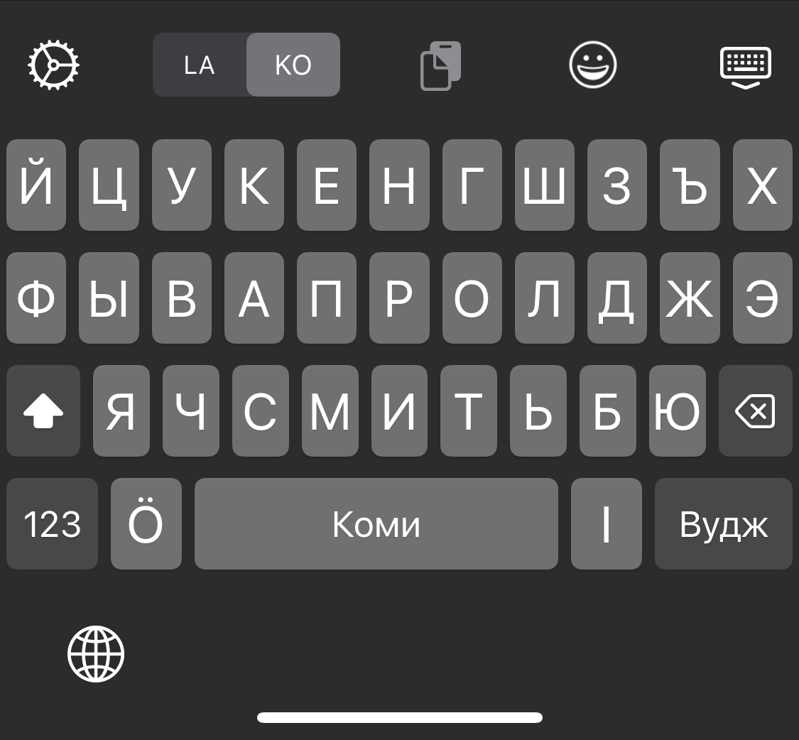
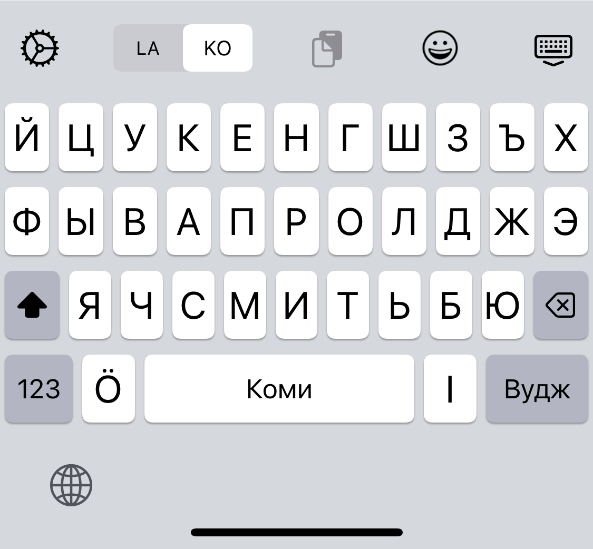
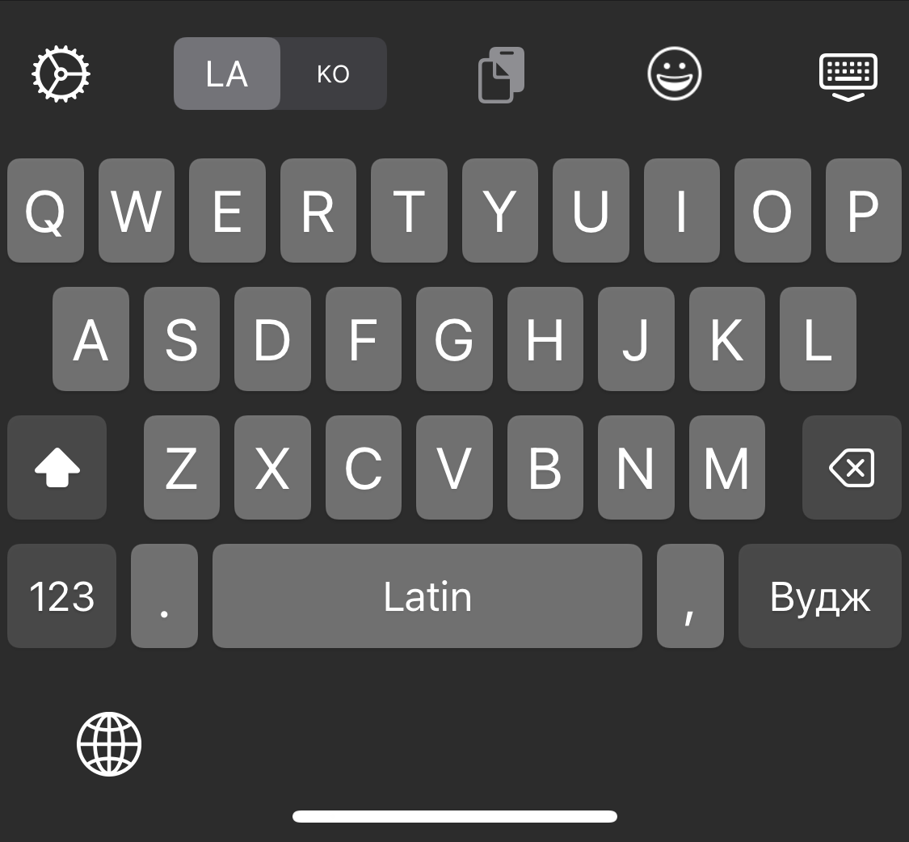

Komi keyboard for iOS
======

## App Store

<a href="https://apps.apple.com/app/id1536776621">
        
        
## Screenshots

## Running compatibility
iOS 13.0+

## Build requirements
Xcode 12.5+

## Credits
- Based on [Cantonese Jyutping Keyboard for iOS](https://github.com/yuetyam/jyutping)
